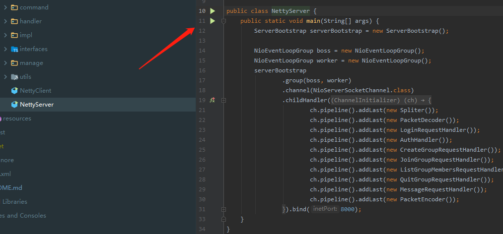
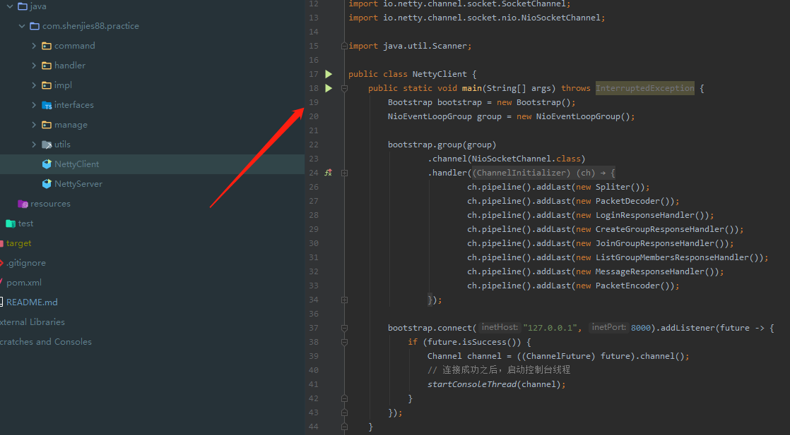
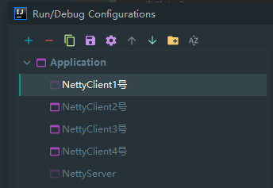

## Netty聊天demo

### 功能

- 登陆

- 退出登陆

- 单聊

- 群聊

### IDEA启动方式

- 服务端启动

- 客户端启动

- 多个客户端

### Jar包启动方式

- mvn clean package -DskipTests

- 服务端
  - java -jar target/netty-im-1.0-SNAPSHOT.jar com/shenjies88/practice/NettyServer.java

- 客户端
   - java -jar target/netty-im-1.0-SNAPSHOT.jar com/shenjies88/practice/NettyClient.java

### 操作指令

- sendToUser 发送消息给指定用户

- logout 退出登陆

- createGroup 创建群聊

- joinGroup 加入群聊

- listGroupMembers 群聊成员列表
